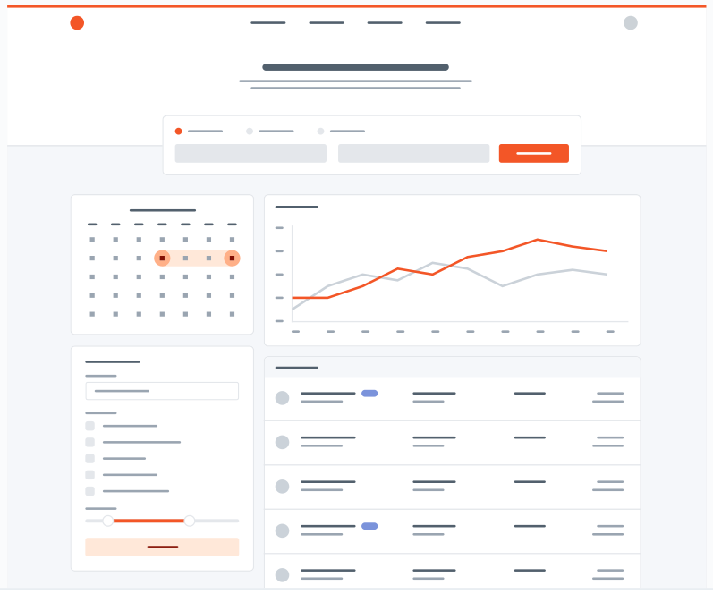

# Color Palette

I have chosen to use the "color palette 21" from the book's (_[Refactoring UI](https://www.refactoringui.com/?ref=sidebar)_) additional material.  
Because orange is to me a warm and energetic color.

---

## "color palette 21"

- (_the header and may be some other elements will get some more orange_)

### Primary Colors, Orange Vivid

These are the **splashes** of color that should appear the most in my UI,
and are the ones that determine the overall "look" of the site. I use those
for things like **primary actions**, **links**, **navigation items**, **icons**, **accent
borders**, or **text I want to emphasize**.

|  |  |  |  |  |
| ---------------------------------------------------------------------------------------- | ---------------------------------------------------------------------------------------- | ---------------------------------------------------------------------------------------- | ---------------------------------------------------------------------------------------- | ---------------------------------------------------------------------------------------- |
| ################                                                                         | ################                                                                         | ################                                                                         | ################                                                                         | ################                                                                         |
| #F9703E                                                                                  | #FF9466                                                                                  | #FFB088                                                                                  | #FFD0B5                                                                                  | #FFE8D9                                                                                  |
| hsl(16, 94%, 61%)                                                                        | hsl(18, 100%, 70%)                                                                       | hsl(20, 100%, 77%)                                                                       | hsl(22, 100%, 85%)                                                                       | hsl(24, 100%, 93%)                                                                       |

|  |  |  |  |  |
| ---------------------------------------------------------------------------------------- | ---------------------------------------------------------------------------------------- | ---------------------------------------------------------------------------------------- | ---------------------------------------------------------------------------------------- | ---------------------------------------------------------------------------------------- |
| ################                                                                         | ################                                                                         | ################                                                                         | ################                                                                         | ################                                                                         |
| #841003                                                                                  | #AD1D07                                                                                  | #C52707                                                                                  | #DE3A11                                                                                  | #F35627                                                                                  |
| hsl(6, 96%, 26%)                                                                         | hsl(8, 92%, 35%)                                                                         | hsl(10, 93%, 40%)                                                                        | hsl(12, 86%, 47%)                                                                        | hsl(14, 89%, 55%)                                                                        |

### Neutral Colors, Cool Grey

These are the colors which I am using the most and will make up the **majority**
of my UI. I use them for most of my **text**, **backgrounds**, and **borders**,
as well as for things like **secondary buttons** and **links**.

|  |  |  |  |  |
| ---------------------------------------------------------------------------------------- | ---------------------------------------------------------------------------------------- | ---------------------------------------------------------------------------------------- | ---------------------------------------------------------------------------------------- | ---------------------------------------------------------------------------------------- |
| ################                                                                         | ################                                                                         | ################                                                                         | ################                                                                         | ################                                                                         |
| #1F2933                                                                                  | #323F4B                                                                                  | #3E4C59                                                                                  | #52606D                                                                                  | #616E7C                                                                                  |
| hsl(210, 24%, 16%)                                                                       | hsl(209, 20%, 25%)                                                                       | hsl(209, 18%, 30%)                                                                       | hsl(209, 14%, 37%)                                                                       | hsl(211, 12%, 43%)                                                                       |

|  |  |  |  |  |
| ---------------------------------------------------------------------------------------- | ---------------------------------------------------------------------------------------- | ---------------------------------------------------------------------------------------- | ---------------------------------------------------------------------------------------- | ---------------------------------------------------------------------------------------- |
| ################                                                                         | ################                                                                         | ################                                                                         | ################                                                                         | ################                                                                         |
| #7B8794                                                                                  | #9AA5B1                                                                                  | #CBD2D9                                                                                  | #E4E7EB                                                                                  | #F5F7FA                                                                                  |
| hsl(211, 10%, 53%)                                                                       | hsl(211, 13%, 65%)                                                                       | hsl(210, 16%, 82%)                                                                       | hsl(214, 15%, 91%)                                                                       | hsl(216, 33%, 97%)                                                                       |
