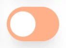

[&#X21e7; back to the "README" &#X21e7;](../../../../README.md)

# Button Components

## Buttons

- link to the Button component [Button.tsx](../../../../components/Button.tsx)
- import the **Button** component (_`import Button from ...`_)
- use the component with its default props `<Button />` (_see below for more prop options_)

|   button style |                                      high priority                                      |                                      medium priority                                      |                                      low priority                                      |                                       _all_ disabled                                        |
| -------------: | :-------------------------------------------------------------------------------------: | :---------------------------------------------------------------------------------------: | :------------------------------------------------------------------------------------: | :-----------------------------------------------------------------------------------------: |
|      **image** |  |  |  |  |
| **style prop** |                                       `style={1}`                                       |                                        `style={2}`                                        |                              `style={3}` <br>**default**                               |                                      `disable={true}`                                       |
| **title prop** |                                    `title={"high"}`                                     |                                    `title={"medium"}`                                     |                                    `title={"low"}`                                     |                                    `title={"disabled"}`                                     |

---

### Button props

---

#### button title

- the default title is "`click me`"
- overwrite the default with the `title` prop (_e.g. `<Button title={"login"} />`_)

---

#### tool tip

- the default tool tip is **empty** unless the button is `disable={true}` then it is **always** `"Button is disabled."`
- overwrite the default with the `tip` prop (_e.g. `<Button tip={"Hello from tool tip."} />`_)

---

### aria label

- the default tool aria label is **empty** unless the button is `disable={true}` then it is **always** `"Button is disabled."`
- overwrite the default with the `aria` prop (_e.g. `<Button aria={"Hello from tool tip."} />`_)

---

### size

- the default size is "`sm`"
- overwrite the default with the `size` prop (_e.g. `<Button size={"base"} />`_)
- the available sizes are based on [taiwinds font size classes](https://tailwindcss.com/docs/font-size) without `text-` (_e.g. tailwinds `text-base` becomes `base`_)

---

### button type

There are 3 types ...

1. the **default button** type where the button works as a normal button, which is the default (`type={"button"}`)
2. the **submit button** is used to submit a forms (`type={"submit"}`)
3. the **reset button** is used to reset a forms (`type={"reset"}`)

---

### callBack function from the parent

- the default is that the function is not doing any thing
- if a function is passed then it is executed when the button is clicked and **NOT** disabled
- the function needs to be defined before of the `return` statement:
  ```jsx
  const handleParent = () => {
    console.log("parent click");
  };
  ```
  ... and can then be passed to the "Button" component
  ```jsx
  <Button callBack={handleParent} />
  ```

---

## Toggle Buttons

- link to the ButtonToggle component [ButtonToggle.tsx](../../../../components/ButtonToggle.tsx)
- import the **ButtonToggle** component (_`import ButtonToggle from ...`_)
- use the component with its default props `<ButtonToggle />` (_see below for more prop options_)

### Toggle Button On/Off

- is controlled over the `onOff` prop which is set by default to `true` (_`onOff={true}`_)
- an option is either on or off (_use callBack function to change code_)
  | button style | high priority on | medium priority on | low priority on |_all_ off|_all_ disabled |
  | -------------: | :-------------------------------------------------------------------------------------: | :---------------------------------------------------------------------------------------: | :------------------------------------------------------------------------------------: | :-----------------------------------------------------------------------------------------: |:-----------------------------------------------------------------------------------------: |
  | **image**| | | | | |
  | **style prop** | `style={1}` | `style={2}` | `style={3}`<br> **default** |`switchOff={true}`<br> _does not work with_ <br>`onOff={false}`| `disable={true}`|

### Toggle Button Switch

- is controlled over the `onOff` prop which needs to be set to `false` (_`onOff={false}`_)
- switches between two options (_use callBack function to change code_)
  | button style | high priority switch | medium priority switch | low priority switch |_all_ disabled |
  | -------------: | :-------------------------------------------------------------------------------------: | :---------------------------------------------------------------------------------------: | :------------------------------------------------------------------------------------: |:-----------------------------------------------------------------------------------------: |
  | **image**| | | | |
  |_left_ **style prop** | `style={1} onOff={false}` | `style={2} onOff={false}` | `style={3}`**default**<br>` onOff={false}` | `disable={true} onOff={false}`|
  |_right_ **style prop** | `style={1} onOff={false}` <br> `switchRight={true}` | `style={2} onOff={false} ` <br> `switchRight={true}` | `style={3}`**default**<br>`onOff={false}` <br> `switchRight={true}`| |

---

#### tool tip

- **tool tip left `tipLeft={}`**
  - default is "`on`" and appears when switched to the left side
  - can be overwritten (_e.g. `tipLeft={"left option"}`_)
- **tool tip right `tipRight={}`**
  - default is "`off`" and appears when switched to the right side
  - can be overwritten (_e.g. `tipRight={"right option"}`_)
- if the button is disabled (_`disable={true}`_) then the tool tip is **always** "`Button is disabled.`"

---

#### aria label

- **aria left `ariaLeft={}`**
  - default is **empty** but it gets the same text as the left tool tip if it is **NOT** `on`
  - can be overwritten (_e.g. `ariaLeft={"left option"}`_)
- **aria right `ariaRight={}`**
  - default is **empty** but it gets the same text as the right tool tip if it is **NOT** `off`
  - can be overwritten (_e.g. `ariaRight={"right option"}`_)
- if the button is disabled (_`disable={true}`_) then the aria label is **always** "`Button is disabled.`"

---

### size

- there are only two sizes, the default size is "`sm`" and the other is "`base`"
- overwrite the default with the `size` prop (_e.g. `<Button size={"base"} />`_)

---

### callBack function from the parent

- the default is that the function is not doing any thing
- if a function is passed then it is executed when the button is clicked and **NOT** disabled
- the function needs to be defined before of the `return` statement:
  ```jsx
  const handleParent = () => {
    console.log("parent click");
  };
  ```
  ... and can then be passed to the "ButtonToggle" component
  ```jsx
  <ButtonToggle callBack={handleParent} />
  ```

---
